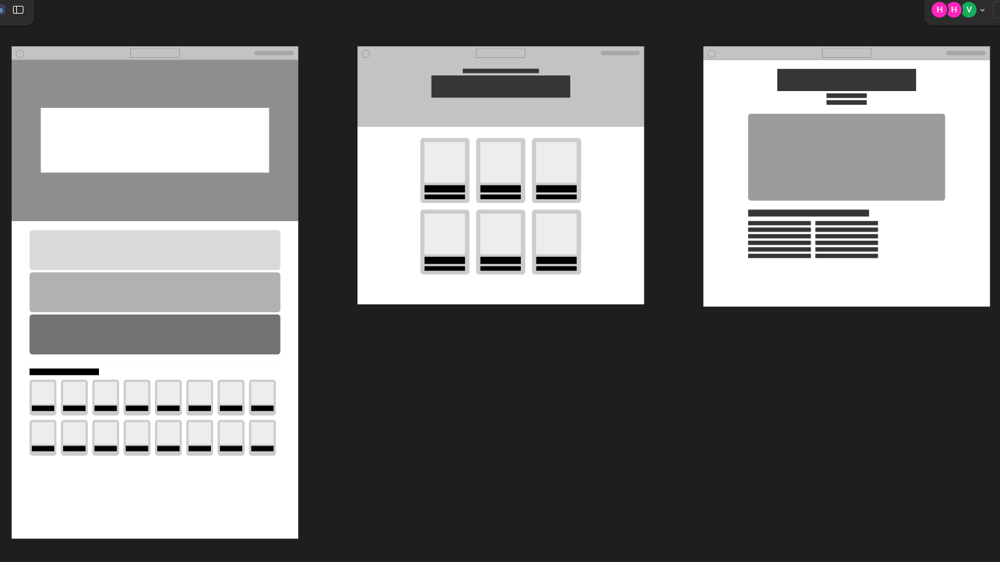
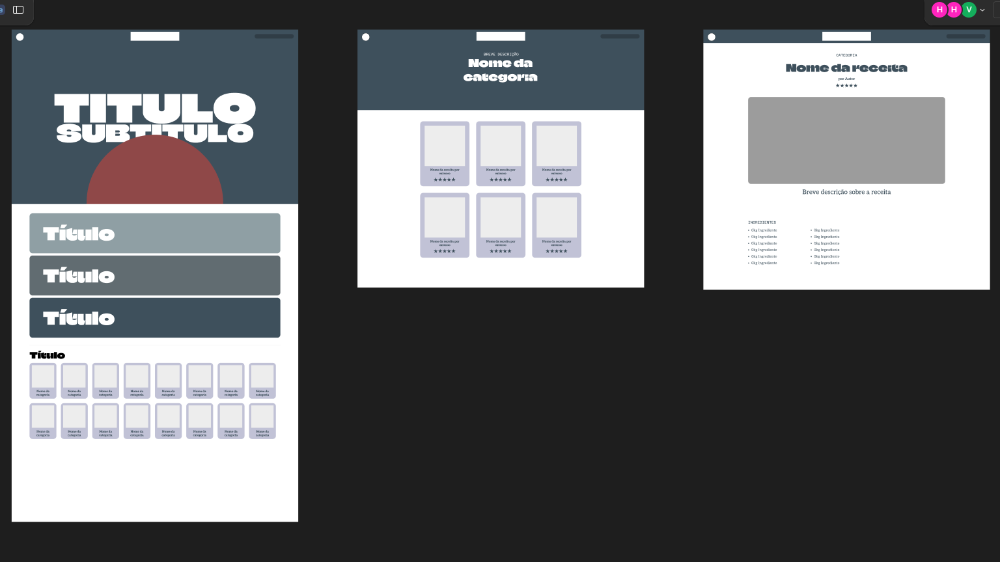
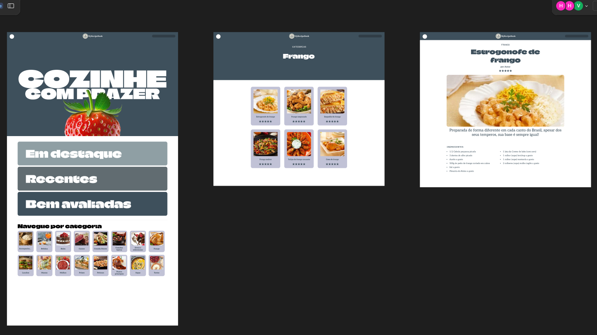

# Plataforma de Receitas - MyRecipeBook

## Escopo

### Descrição Geral

Será desenvolvida uma plataforma de receitas, onde cada usuário logado terá a possibilidade de cadastrar suas próprias receitas, além de navegar e interagir com receitas criadas por outros usuários. Os usuários poderão avaliar as receitas com notas e comentários. A plataforma funcionará como um livro de receitas comunitário, permitindo o compartilhamento de criações culinárias e incentivando a exploração de novas ideias para refeições.

<strong>Escopo</strong>

### Objetivos Gerais

- Facilitar o cadastro e compartilhamento de receitas pelos usuários.
- Oferecer uma interface intuitiva para navegar e buscar receitas.
- Implementar um sistema de avaliação e comentários para melhorar a interação entre os usuários.
- Promover a troca de experiências culinárias dentro da comunidade.

### Metas SMART

#### Específicas

- Desenvolver um sistema de cadastro e autenticação de usuários.
- Permitir que os usuários avaliem e comentem nas receitas.
- Implementar filtros de busca por tipo de receita, ingredientes e categoria (ex: sobremesas, pratos principais).
- Garantir a segurança dos dados e a integridade das funcionalidades.

#### Mensuráveis

- Atingir 1000 receitas cadastradas no primeiro mês.
- Obter avaliações de pelo menos 30% das receitas registradas.
- Manter uma taxa de engajamento de comentários em pelo menos 30% das receitas.

#### Atingíveis

- Garantir que os usuários possam facilmente cadastrar, editar e visualizar receitas.
- Permitir avaliações e comentários de forma funcional e intuitiva.

#### Relevante

- Promover o compartilhamento de receitas entre os usuários, criando um ambiente colaborativo.
- Oferecer ferramentas fáceis para a navegação e busca por receitas.

#### Temporal

- Deve ser concluído em 1 mês.
- Reuniões periódicas para alinhamento e progresso do projeto.

### Recursos

- **Linguagem de Programação:** JavaScript
- **Compilador:** Node
- **Framework FrontEnd/BackEnd:** Next.js
- **Banco de Dados:** MongoDB
- **Design de Interfaces:** Figma
- **IDE para Desenvolvimento:** VSCode
- **Documentação:** README (GitHub)
- **Controle de Versão:** GitHub

### Recursos Humanos

- **Desenvolvedores Backend Pleno:** 2
- **Desenvolvedores Backend Junior:** 1
- **Desenvolvedores Frontend Pleno:** 1
- **Desenvolvedor Banco de Dados Pleno:** 1
- **Estagiário:** 1

### Análise de Riscos

#### Riscos e Soluções

- **Falta de Comunicação:**  
  **Solução:** Reuniões semanais para verificação de progresso.

- **Quedas de Energia:**  
  **Solução:** Contatar o provedor e utilizar notebooks.

- **Oscilação de Internet:**  
  **Solução:** Contatar o provedor.

- **Atraso nas Entregas:**  
  **Solução:** Verificar com a equipe as possíveis causas, atualizar o cronograma e resolver problemas.

- **Instabilidade na Utilização de Recursos:**  
  **Solução:** Utilizar recursos alternativos (ex: se Figma cair, usar Canva; se VSCode cair, usar Eclipse ou Codespace).

- **Adversidade com Membros da Equipe:**  
  **Solução:** Redistribuir atividades para outros integrantes da equipe e ajustar o cronograma conforme necessário.

<strong>Cronograma</strong>

## Cronograma do Projeto

<strong>Diagramas</strong>

### Diagrama de Classe:

### Diagrama de Uso:

### Diagrama de Fluxo:

[Protótipos no Figma](https://www.figma.com/design/FDwebPRgBJIBdVcXLWyhG5/MyRecipeBook?m=auto&t=IP4AiYEfyHAjkNTz-1)

## Baixa Fidelidade | Wireframe

## Média Fidelidade | Mid-Fidelity

## Alta Fidelidade | High-Fidelity

